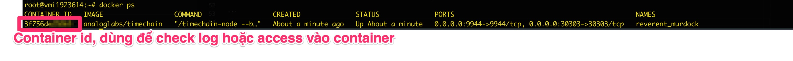

## Cách chạy Timechain Node dự án Analog

Lưu ý trước khi làm: Hiện tại dự án đang mở form đăng kí chạy node nên ae chỉ cần làm đến bước 2 là đủ thông tin nộp form rồi 

Sau khi được chọn thì mới có thể làm tiếp được 

### 1. Chuẩn bị 

Để chạy node dự án b cần chuẩn bị 1 máy tính hoặc vps có cấu hình CPU 8core, RAM 16GB, STORAGE ít nhất 300Gb SSD
Với cấu hình này thì mình sẽ mua vps-3 ở trên Contabo vì giá khá rẻ so với những chỗ khác 
Link mua: https://contabo.com/en/vps/cloud-vps-3/?image=ubuntu.267&qty=1&contract=1&storage-type=vps-3-1-2-tb-ssd

Khi mua lưu ý chọn hệ điều hành Ubuntu 22.04

### 2. Các bước cài 

- Bạn ssh vào server đã mua bằng câu lệnh và nhập password

```
ssh root@ip_server
```

#### 2.1 Cài đăt docker 

```
sudo apt update

sudo apt install apt-transport-https ca-certificates curl software-properties-common

curl -fsSL https://download.docker.com/linux/ubuntu/gpg | sudo gpg --dearmor -o /usr/share/keyrings/docker-archive-keyring.gpg

echo "deb [arch=$(dpkg --print-architecture) signed-by=/usr/share/keyrings/docker-archive-keyring.gpg] https://download.docker.com/linux/ubuntu $(lsb_release -cs) stable" | sudo tee /etc/apt/sources.list.d/docker.list > /dev/null

sudo apt update


apt-cache policy docker-ce

sudo apt install docker-ce
```

#### 2.2 Cài đặt node 

* lưu ý --name=MyNode thay MyNode bằng tên node mà bạn đặt, cái này để điền form nhé 
```
# Tải image của node 
docker pull analoglabs/timechain
# Chay node
docker run -d -p 9944:9944 -p 30303:30303 analoglabs/timechain --base-path /data --rpc-external  --unsafe-rpc-external --rpc-methods=unsafe --name=MyNode --telemetry-url "wss://telemetry.analog.one/submit 0"
```

#### 2.3 Kiểm tra 

Để kiểm tra node của bạn đã chạy hay chưa thì bạn có thể dùng lệnh sau 

```
docker ps
```

Nếu có kết quả như ảnh thì node của bạn đã đc chạy


Để kiểm tra logs thì bạn cần có id của container đang chạy (dùng lệnh docker ps ở trên để lấy container_id)
```
docker logs container_id
```
* lưu ý, ở đây bạn có thể check đc tên node cũng như cấu hình node 

Sau bước này ae đã đủ thông tin để điền form và khấn thôi. Link form: https://l5d87lam6fy.typeform.com/to/kwlADm6U

Tạo element Hander ae có thể vào trang này, dùng gmail để đăng kí tài khoản. 

https://app.element.io/

Tài khoản đc tạo sẽ có dạng @xxxxx:matrix.org, dùng cái này để điền form

### 3. Tạo và đăng kí Session Keys (Bươc này chưa cần làm)

#### 3.1 Tạo key 

curl -H "Content-Type: application/json" -d '{"id":1, "jsonrpc":"2.0", "method": "author_rotateKeys", "params":[]}' http://127.0.0.1:9944

Hash ở result chính là session key đã đc tạo ra. Hãy lưu lại key này 
